# Math example gallery

Actual Photoshop image exports, not UI screenshots. All examples use a deterministic synthetic nebula and stars fixture (960 × 640, 16-bit RGB, sRGB). JPEGs are display copies; the calculations use native sample values.

Open [the visual gallery](gallery.html) for larger images and downloadable recipes. Imported recipes require explicit layer bindings.

For the live mask example, bind A and B as Pixels and M as Mask, enter `mix(A, B, M)`, and enable Live result. Inverting the attached source mask automatically updates the same output layer. No clipping mask is needed. The plugin must be running, and the document must be active. Mask inputs use density 100% and feather 0. Exported recipes do not automatically enable Live result.

## 1 · Source layer mask

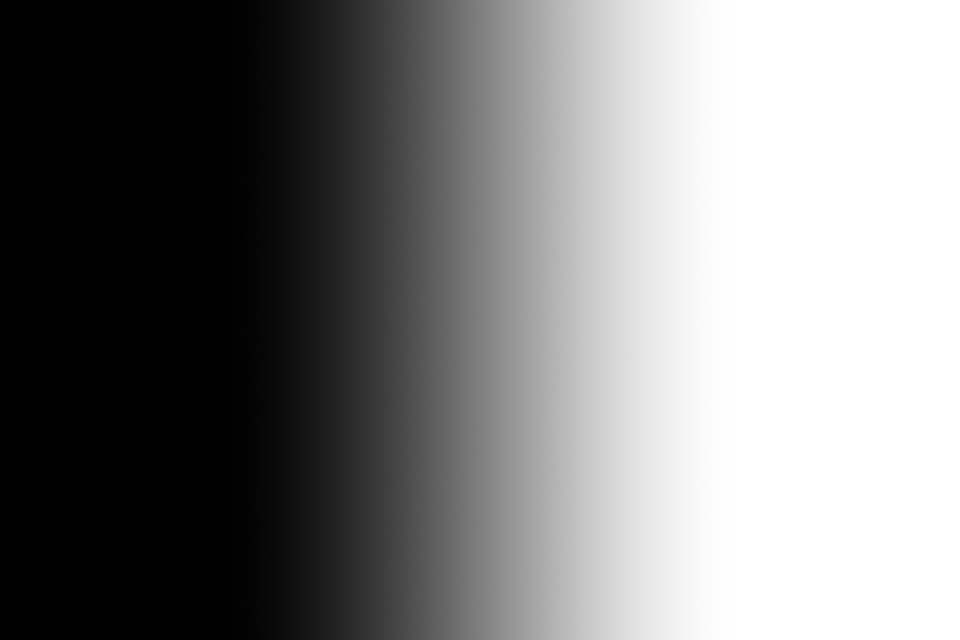

```text
M
```

No named parameters.

M ← Screen recombination → Mask

An attached pixel mask, displayed as grayscale. Black keeps A; white selects B in the live blend.

16-bit output; no rescaling or clipping needed.

[Importable recipe](../examples/gallery/layer-mask-before.json)

## 2 · Live result before mask edit


```text
mix(A, B, M)
```

No named parameters.

A ← Screen recombination → Pixels; B ← Midtones stretch → Pixels; M ← Screen recombination → Mask

Live result enabled. The right side receives the stretch; the left retains the original pixels.

16-bit output; no rescaling or clipping needed.

[Importable recipe](../examples/gallery/live-mask-before.json)

## 3 · Source mask after inversion

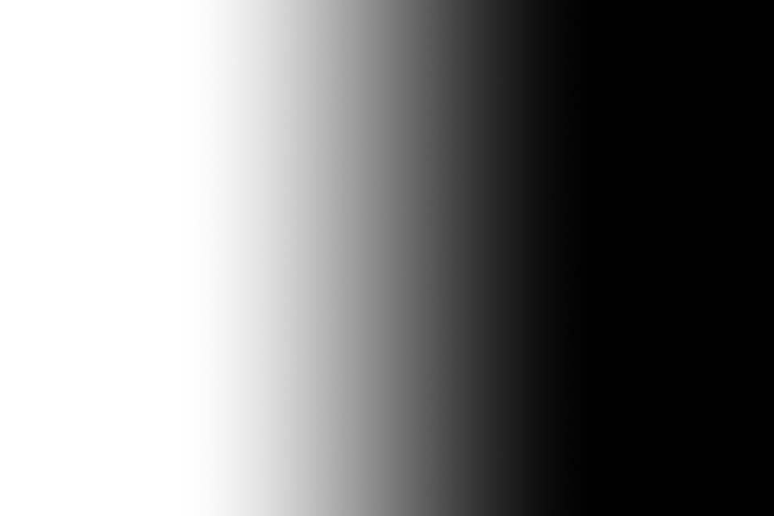

```text
M
```

No named parameters.

M ← Screen recombination → Mask (inverted)

Only the attached source mask was edited. The formula and source pixel layers are unchanged.

16-bit output; no rescaling or clipping needed.

[Importable recipe](../examples/gallery/layer-mask-after.json)

## 4 · Same result after automatic refresh


```text
mix(A, B, M)
```

No named parameters.

A ← Screen recombination → Pixels; B ← Midtones stretch → Pixels; M ← Screen recombination → Mask (inverted)

Captured after the live controller detected the source edit and updated the same layer. The stretch now affects the left side.

16-bit output; no rescaling or clipping needed.

[Importable recipe](../examples/gallery/live-mask-after.json)

## Multiply pixels by a mask

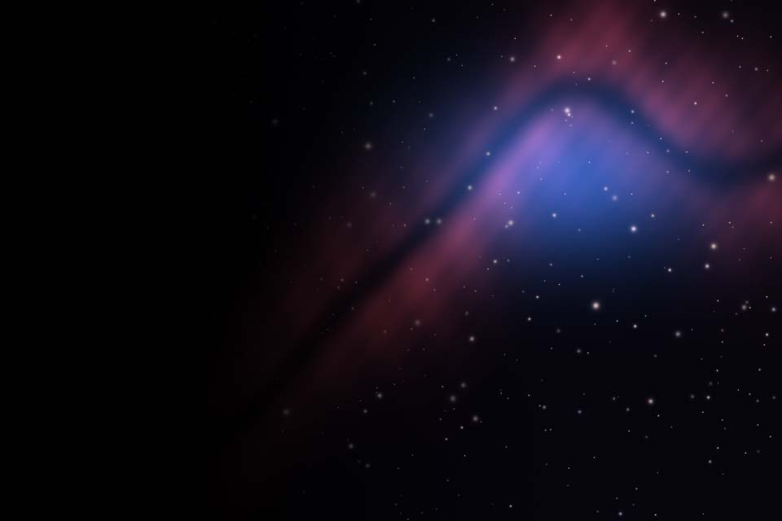

```text
A*M
```

No named parameters.

A ← Screen recombination → Pixels; M ← Screen recombination → Mask

Mask arithmetic: black becomes 0, white retains A, intermediate values attenuate A.

16-bit output; no rescaling or clipping needed.

[Importable recipe](../examples/gallery/multiply-layer-mask.json)

## Write a formula into a layer mask

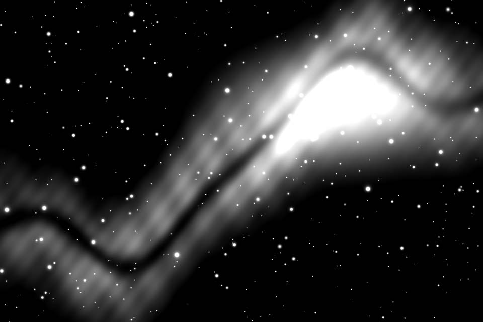

```text
clamp((0.2126*A[0] + 0.7152*A[1] + 0.0722*A[2] - 0.05) / 0.3, 0, 1)
```

No named parameters.

A ← Screen recombination → Pixels

An actual attached mask created by the formula, read back and displayed as grayscale. Mask output is one-shot; live output currently uses a pixel layer.

Attached mask output (0–1); no rescaling or clipping needed.

[Importable recipe](../examples/gallery/generated-layer-mask.json)

## Screen recombination


```text
combine(Starless, Stars, op_screen())
```

No named parameters.

Starless ← Starless; Stars ← Stars


16-bit output; no rescaling or clipping needed.

[Importable recipe](../examples/gallery/screen.json)

## Midtones stretch

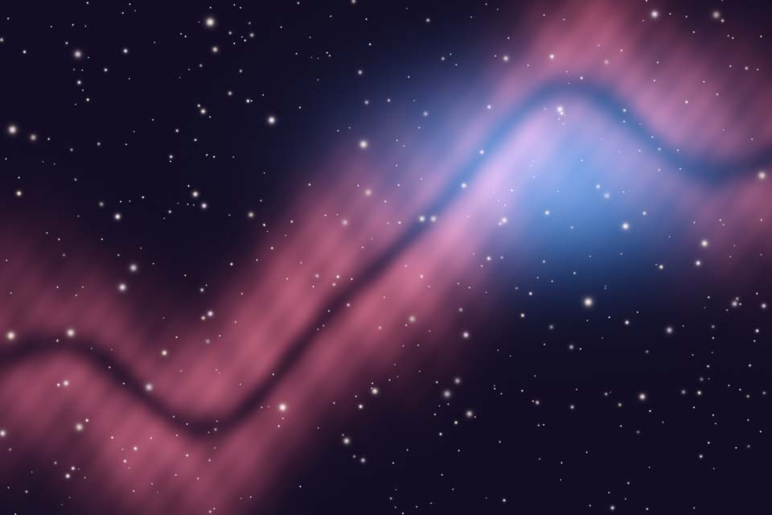

```text
mtf(midtones, A)
```

midtones = 0.25

A ← Screen recombination


16-bit output; no rescaling or clipping needed.

[Importable recipe](../examples/gallery/midtones.json)

## Screen stars with strength

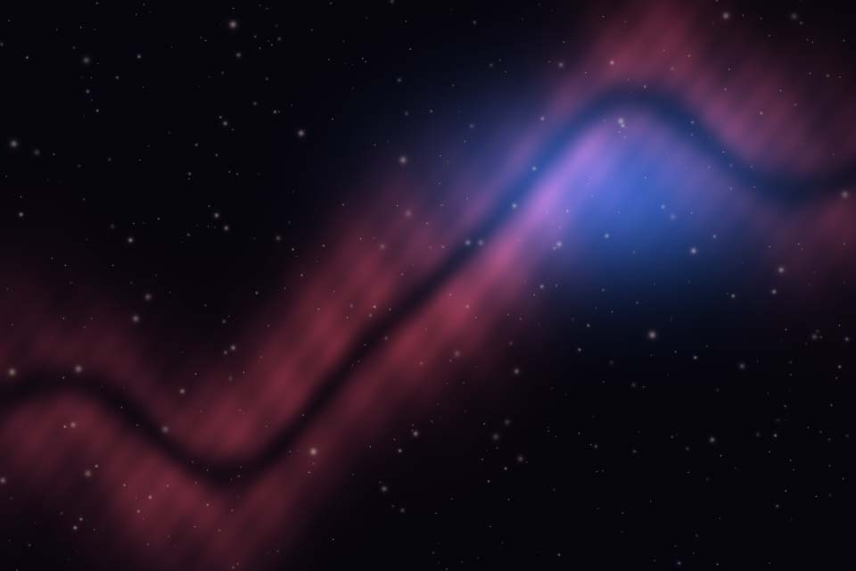

```text
combine(Starless, strength * Stars, op_screen())
```

strength = 0.5

Starless ← Starless; Stars ← Stars


16-bit output; no rescaling or clipping needed.

[Importable recipe](../examples/gallery/half-stars.json)

## Extract screen stars

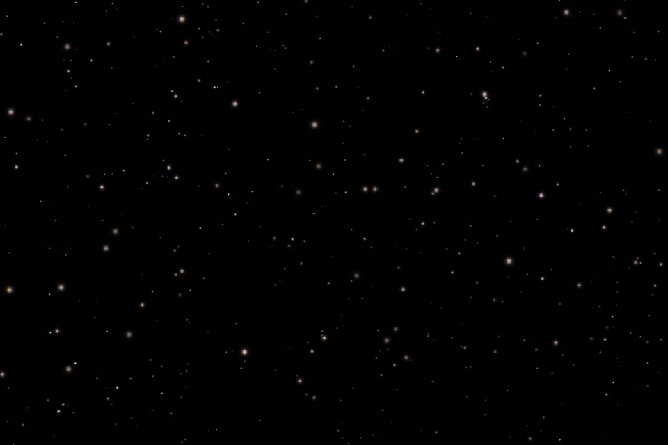

```text
iif(Starless < 1, (Combined - Starless) / (1 - Starless), 0)
```

No named parameters.

Combined ← Screen recombination; Starless ← Starless


16-bit output; no rescaling or clipping needed.

[Importable recipe](../examples/gallery/extracted-stars.json)

## Logarithmic stretch

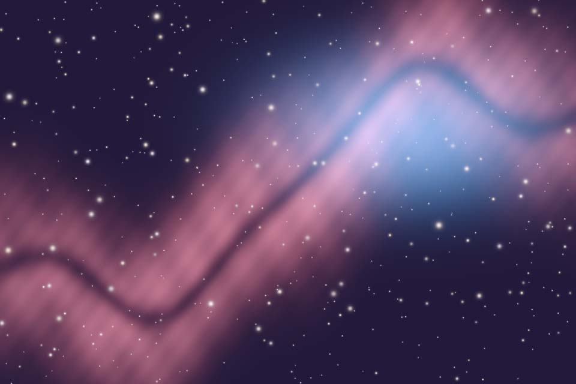

```text
ln(1 + strength * A) / ln(1 + strength)
```

strength = 20

A ← Screen recombination


16-bit output; no rescaling or clipping needed.

[Importable recipe](../examples/gallery/log-stretch.json)

## Gamma

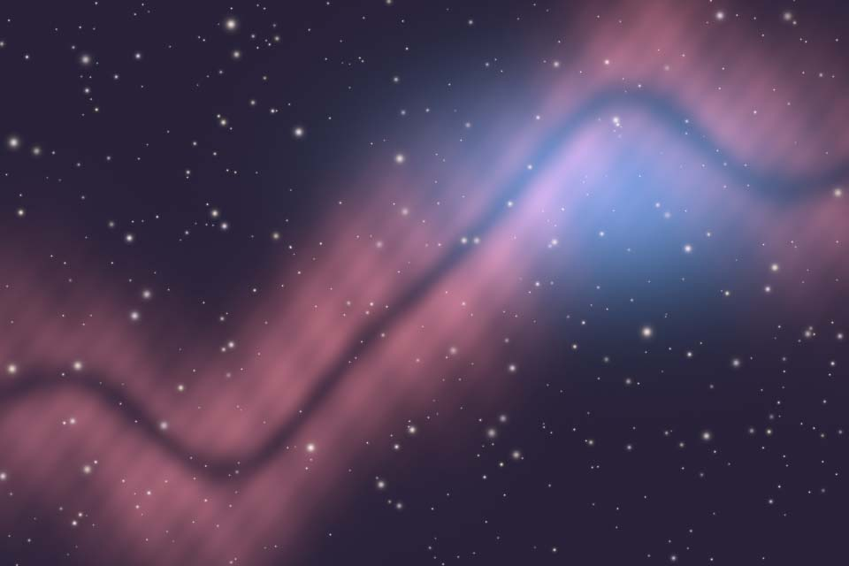

```text
pow(A, 1 / gamma)
```

gamma = 2

A ← Screen recombination


16-bit output; no rescaling or clipping needed.

[Importable recipe](../examples/gallery/gamma.json)

## RGB average grayscale

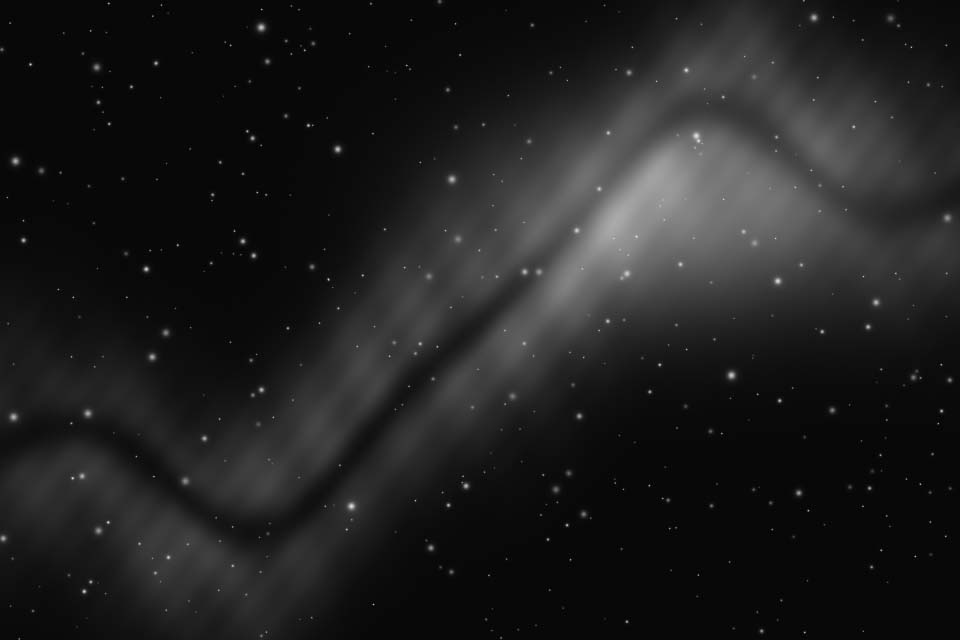

```text
(A[0] + A[1] + A[2]) / 3
```

No named parameters.

A ← Screen recombination


16-bit output; no rescaling or clipping needed.

[Importable recipe](../examples/gallery/grayscale.json)

## Channel gains

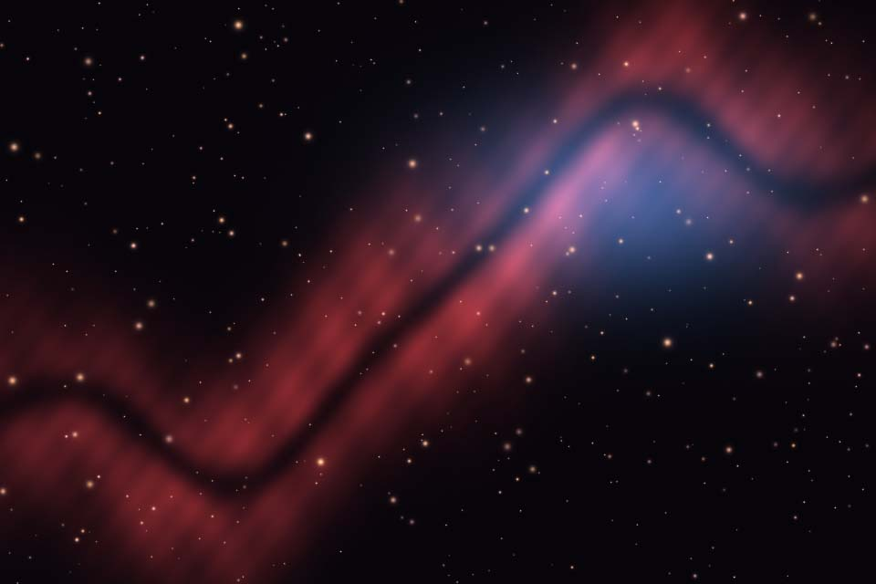

```text
R: red * A[0]
G: green * A[1]
B: blue * A[2]
```

red = 1.2, green = 1, blue = 0.8

A ← Screen recombination


16-bit output; Clip to 0–1 explicitly selected.

[Importable recipe](../examples/gallery/channel-gains.json)

## Swap red and blue

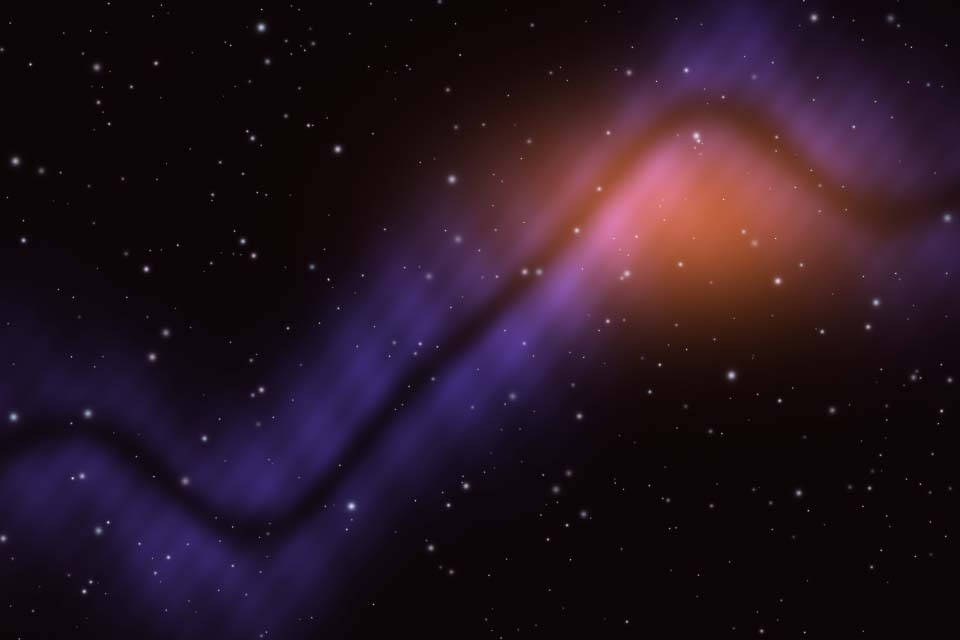

```text
R: A[2]
G: A[1]
B: A[0]
```

No named parameters.

A ← Screen recombination


16-bit output; no rescaling or clipping needed.

[Importable recipe](../examples/gallery/swap-channels.json)

## Soft threshold mask

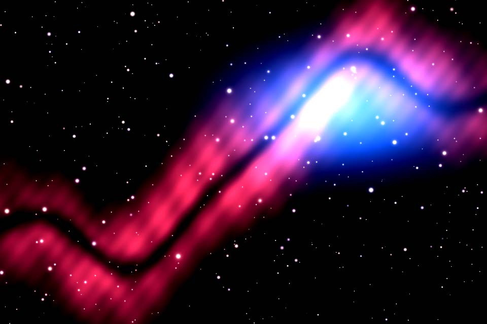

```text
clamp((A - low) / (high - low), 0, 1)
```

low = 0.1, high = 0.4

A ← Screen recombination


16-bit output; no rescaling or clipping needed.

[Importable recipe](../examples/gallery/soft-mask.json)

## Range mask

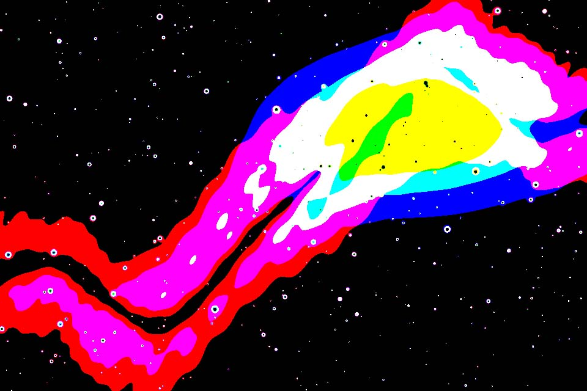

```text
iif(A >= low && A <= high, 1, 0)
```

low = 0.15, high = 0.5

A ← Screen recombination


16-bit output; no rescaling or clipping needed.

[Importable recipe](../examples/gallery/range-mask.json)

## Invert

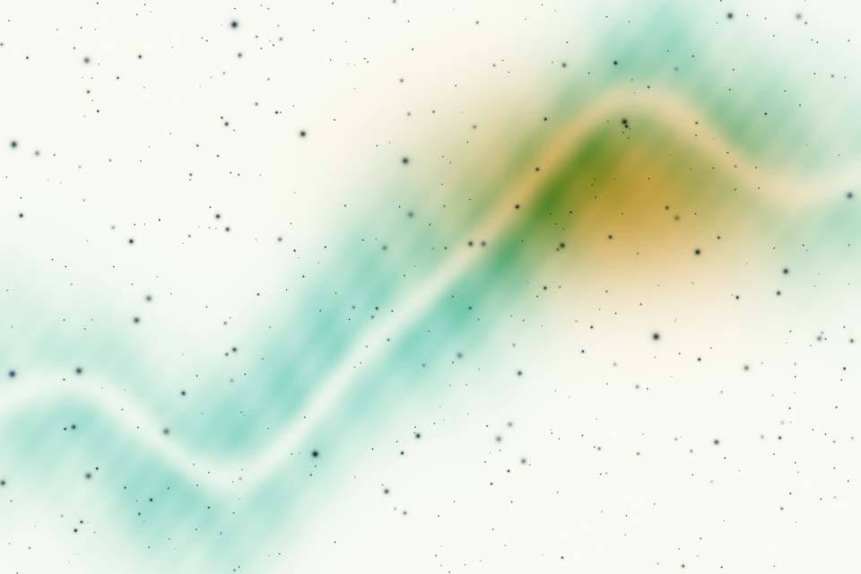

```text
1 - A
```

No named parameters.

A ← Screen recombination


16-bit output; no rescaling or clipping needed.

[Importable recipe](../examples/gallery/invert.json)

## Masked midtones blend

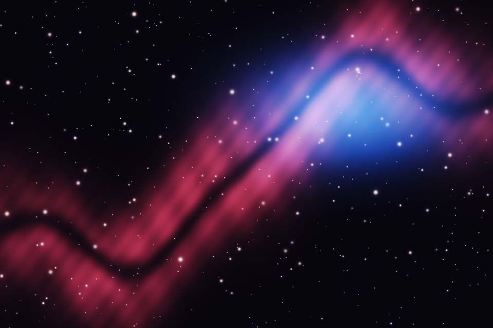

```text
mix(A, B, clamp(Mask, 0, 1))
```

No named parameters.

A ← Screen recombination; B ← Midtones stretch; Mask ← Soft threshold mask


16-bit output; no rescaling or clipping needed.

[Importable recipe](../examples/gallery/masked-blend.json)
